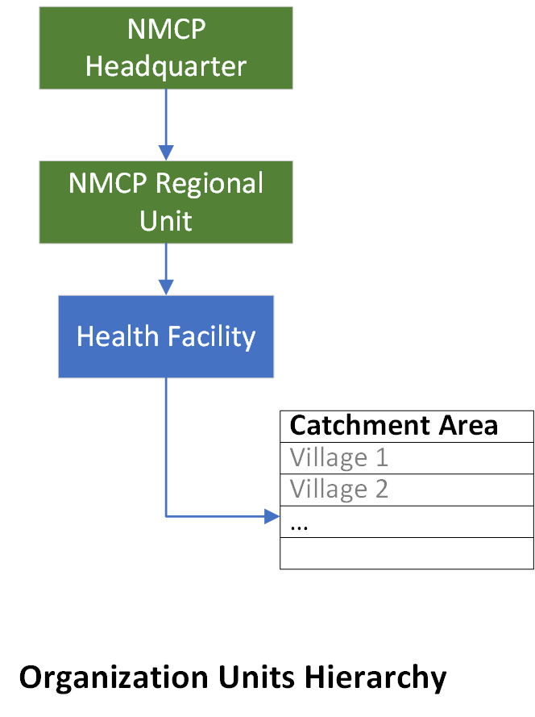
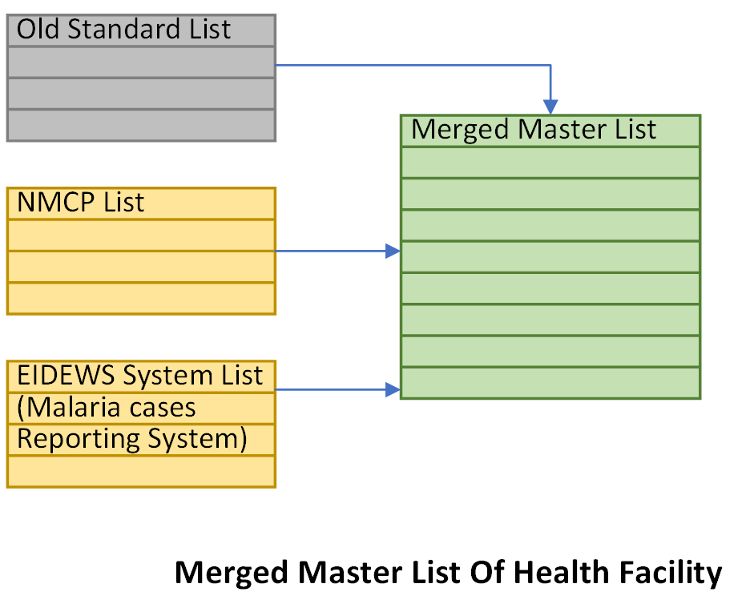

# Report final

**Project:** Data assembly and cleaning Of NMCP Yemen and automating the workflow

## Executive Summary

**Challenge:** The National Malaria Control Program (NMCP) in Yemen faces significant challenges in analyzing and utilizing its vast data on malaria control activities due to inconsistencies in data formats, codes, and collection methods. This lack of data accessibility and quality hinders effective program evaluation, intervention targeting, and resource allocation.

**Approach:** The project used a Collaborative Approach Engaging a cross-functional team to collaboratively address inconsistencies in data formats, Actively involving *Risk analysis team* in harmonization decisions, ensuring alignment with program goals, and Iteratively refining entity relationships based on feedback from them and NMCP management. The collaborative approach has resulted in a coherent dataset that reflects the collective expertise of the team.

**Result:** This project successfully mapped all NMCP activity data into a structured format, significantly improving data accessibility and quality. Data completeness and accuracy metrics saw substantial improvements, and the established data model allows for comprehensive analysis across different entities and activities. Data visualization dashboards now provide real-time insights into key malaria control indicators, enabling informed decision-making for program optimization and resource allocation. Any Future data can be easily checked, validated, cleaned, and merged using the automated solution and the pipeline developed in this project.

**Impact:** This project empowers the NMCP with a robust data foundation for effective malaria control efforts. Improved data accessibility and quality will lead to:

* **Enhanced program monitoring and evaluation:** Real-time data insights will enable the NMCP to track progress towards malaria elimination goals and identify areas requiring improvement.
* **Targeted interventions:** Data-driven analysis will inform the development of more effective and targeted interventions, maximizing resource utilization and impact.
* **Improved resource allocation:** Data analysis will guide the allocation of resources to areas with the highest burden of malaria, ensuring efficient and equitable program implementation.
* **Knowledge sharing and collaboration:** The structured data model facilitates data sharing and collaboration with other stakeholders, promoting knowledge exchange and coordinated efforts in malaria control.

**Recommendations:** Building upon this success, the NMCP should:

* **Continue data quality improvement:** Implement ongoing data quality monitoring and maintenance procedures to ensure data integrity and reliability.
* **Integrate with other data sources:** Combine malaria control data with other relevant data sources (e.g., weather, population) for comprehensive analysis and prediction.
* **Promote data utilization:** Train NMCP personnel and stakeholders on data analysis tools and techniques to maximize the utilization of data for informed decision-making.

By leveraging the foundation established by this project, the NMCP can accelerate its progress towards a malaria-free future in Yemen.

## Introduction

Malaria remains a significant public health threat in Yemen, with 150K cases reported annually. Effective control requires a comprehensive understanding of the disease dynamics, intervention effectiveness, and resource allocation strategies. However, the National Malaria Control Program (NMCP) faces significant challenges in utilizing its vast data on malaria control activities due to:

* **Data inconsistencies:** Data from various sources often use different formats, codes, and collection methods, making it difficult to integrate and analyze effectively.
* **Data quality issues:** Incompleteness, inaccuracies, and missing data further hinder the reliability and usability of the information.
* **Limited data accessibility:** Data is often stored in disparate silos, making it difficult for program managers and stakeholders to access and utilize it for informed decision-making.

Recognizing these challenges, the NMCP embarked on a critical initiative to map all its activity data into a unified, structured format. This project aimed to:

* **Create master lists:** Review and Update the standardized lists available of key entities involved in malaria control, such as villages, health facilities, and community health volunteers. and develop the missing ones needed for the mapping process.
* **Connect/Define Catchment of each health facilities:** connect health facilities with their corresponding catchment villages. Building on an Existing mapping and utilizing a data-driven approach and robust methodologies, to establish a detailed catchment map that empowers informed resource allocation and optimizes service delivery within the region.
* **Automated Data Pipelines (Pentaho and Python-Powered):** Implement lately to streamlined data processing and maintained data integrity throughout the analysis by employing Pentaho to orchestrate data extraction, and transformation processes. create scripts to address some data inconsistencies, including standardization, and normalization.
* **Clean and merge data:** Review, clean, and merge data routine/not routine data from various sources, ensuring consistency and compatibility with the master lists.
* **Develop data visualization tools:** Create interactive dashboards and reports to visualize trends, analyze intervention effectiveness, and track progress towards malaria control goals.
* **Implement testing:** to guarantee data integrity and consistency before merging into the production Database.

This report details the methodology, results, and impact of this data mapping project. It highlights the significant improvements in data accessibility, quality, and utilization, paving the way for enhanced malaria control efforts in Yemen.

## 2. Methodology

### 2.1 Data Sources

The project integrated data from the following primary sources:

* **ITN Distribution Data:**
      - **Format:** Excel spreadsheets with village codes, household counts, net quantities, team, date, etc.
      - **Inconsistencies:**
        - Village code formats: Mixing numeric and alphanumeric formats, missing or incomplete codes.
        - Data entry errors.
        - Missing values, inconsistencies with reported village population.
        - Mismatches in date of submission_time.
* **IRS Data:**
      - **Format:** Excel spreadsheets with sprayed structures, dates, insecticides, ...
      - **Inconsistencies:**
        - Village code formats: Mixing numeric and alphanumeric formats, missing or incomplete codes.
        - Personnel names: Variations in spelling, abbreviations, missing names.
        - Mismatches in date of submission_time
* **LSM Data:**
      - **Format:** Paper-based and Electronic forms with breeding site identification, treatment methods, dates.
      - **Inconsistencies:**
        - Transcription errors due to manual data entry.
        - Incompatible data types for similar variables (e.g., income as categorical vs. continuous)
        - Incomplete data: Missing information on breeding site type, treatment dosage, etc.
* **CHV Data:**
      - **Format:** Excel spreadsheets with CHV demographics, village assignments, malaria case reports.
      - **Inconsistencies:**
        - Duplicate CHV records due to name variations or reassignments.
        - Village: Not coded and uses names having variations in spelling, missing or incomplete names.
        - Missing info about time of assignment or withdrawal.
* **Malaria Cases Data:**
      - **Format:** NMCP database with Monthly case reports, EIdews database with Weekly case reports.
      - **Inconsistencies:**
        - Inconsistencies in coding systems, data entry errors, and missing values were common.
        - Facility codes: Inaccurate or outdated facility codes impacting data aggregation.
        - Different temporal collection: 2011-2016 Monthly, and 2017 onward is weekly.
        - adding/removing dataelements and updating structure from year to another.
        - changed sources of data: NMCP and then EIdews, resulting in discrepancies in health facility coding, often with varying levels of granularity
* **Administrative Data:**
      - **Format:** Country GIS Geodata database, Standard Health Facilities information, Excel spreadsheets Community Health Volunteers list.
      - **Inconsistencies:**
        - Outdated Country GIS Geodata database.
        - Facility codes: Inaccurate or outdated facility codes impacting data aggregation.
        - Duplicate of records in the GIS Geodata database.
        - Other different inconsistencies.
        - Duplicate Health Facilities records and inconsistencies in names required automated and manual careful resolution.

### 2.2 Processing Workflow

**2.2.1 Data Cleaning and Transformation:**

* **Standardization:**
      - Village codes: Harmonized across datasets using a master list, ensuring one-to-one mapping and eliminating ambiguities.
      - Date formats: Converted to a consistent format (e.g., ISO 8601) for improved sorting and analysis.
      - Personnel names: Standardized using string normalization techniques and cross-referencing with personnel records.
      - Implement soundex and other phonetic matching techniques to identify potential duplicates and variations, followed by manual verification and standardization.
      - Temporal Alignment: Align Malaria Cases data with varying temporal granularities using interpolation and/or aggregation techniques.
* **Error Correction:**
      - Applied techniques such as rule-based error correction, outlier detection, and imputation to address inconsistencies and missing values..
      - Fuzzy matching to link village/HF names with similar spellings in the master list.
      - Leverage Python library dateutil to parse various formats and convert to a consistent ISO 8601 standard.
      - Utilize imputation techniques like mean/median imputation or K-Nearest Neighbors to fill in missing values based on context and relationships within the data.
      - Manual review and correction of identified errors, ensuring data integrity.
* **Outlier Handling:**
      - Investigation of potential outliers (e.g., unusually high net distributions) through data visualization and cross-referencing with other sources.
      - Contextualization of outliers based on local factors or data collection methods.

**2.2.2 Master List Creation and Maintenance:**

* **Village list:** Consolidated and standardized village names and codes from multiple sources, addressing duplicates and inconsistencies.
* **Health facility list (HF):**
      - A comprehensive list of health facilities was created with unique codes, names, and geographic coordinates, merging HFs from EIdews Malaria cases reporting system and NMCP records to provide a clear picture of health infrastructure.
      - Checked and updated the list through collaboration with local authorities and community to reflect changes in facility closures, expansions, or changes in operational status.

{ align=center, width="400" }

{ align=center, width="450" }

* **CHV list:**
      - Compiled a comprehensive list of CHVs with unique identifiers, demographic information, village assignments, and contact details, resolving duplicate records.
      - Implement de-duplication algorithms to identify and merge duplicate CHV records based on unique identifiers, demographics, and village assignments.
      - Cross-reference CHVs with village master list to ensure accurate village assignments and avoid inconsistencies.

#### 2.2.3 Data Merging and Integration

* **Mapping to master lists:** Linked activity data to corresponding master lists using village codes, health facility codes, and CHV identifiers.
* **Resolving Record Linkage Issues:** Employed probabilistic matching techniques to account for variations in names and addresses, with manual verification for high-confidence matches.
* **Resolving inconsistencies:** Addressed discrepancies in codes or names through manual verification and cross-referencing with original data sources.
* **Data validation checks:** Implemented automated checks to ensure consistency between data sources, such as comparing ITN quantities with household counts and verifying CHV village assignments, proactively identifying and addressing potential errors.

#### 2.2.4 Data Quality Assessment

* **Data lineage tracking:** Tracing the origin and transformations of each data point to ensure transparency and auditability.
* **Validation checks:** IImplement domain-specific validation rules (e.g., checking if reported net quantities fall within plausible ranges for village sizes). Verified data integrity through cross-referencing with external sources (e.g., population data).
* **Completeness Analysis:** Calculate the percentage of missing values for key variables and analyze the distribution of missingness across different datasets. Identify patterns and potential reasons for missing data (e.g., reporting delays, data entry challenges). Documented for improved future training programs to improve data collection and reporting practices.

### 2.3 Tools and Technologies

* **Data cleaning and integration:** Python (pandas, NumPy), Pentaho Data Integration and MetaData Management, OpenRefine, facilitated automated data manipulation and cleaning tasks. SQL, Excel.
* **Data storage:** PostgreSQL database with version control and audit trails.
* **Data visualization:** Power BI enabled the creation of interactive dashboards and reports for data visualization and analysis.

### Additional Enhancements

* **Diagrams:** Visually depict the data processing workflow, master list structures, and relationships between datasets.
* **Tables:** Summarize data quality metrics, such as completeness rates and error rates, for each dataset and stage of the process.
* **Code Snippets:** Provide examples of key data cleaning and transformation techniques, demonstrating practical implementation.
